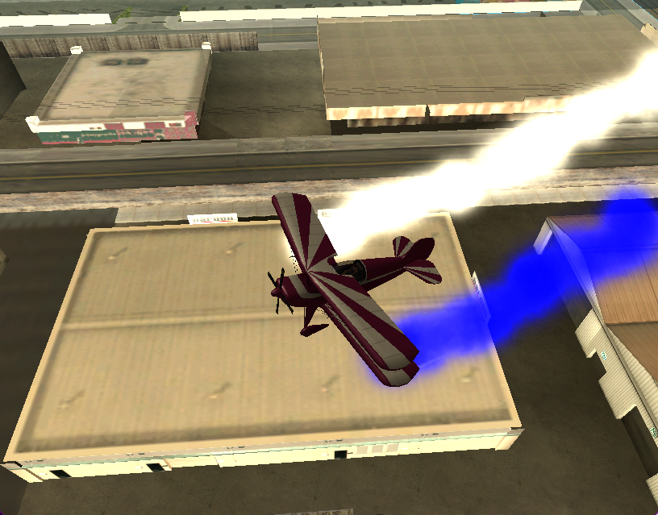
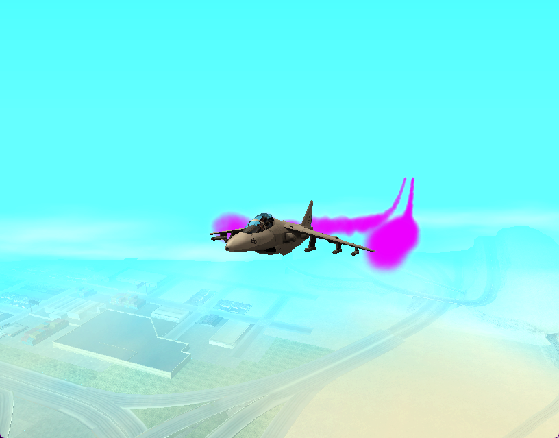
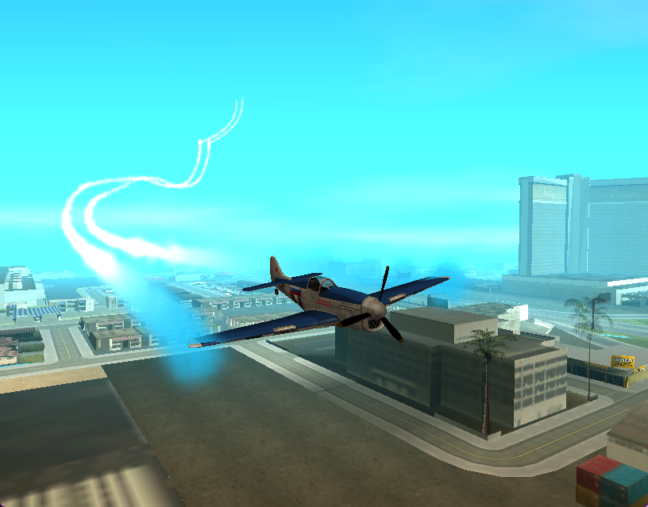
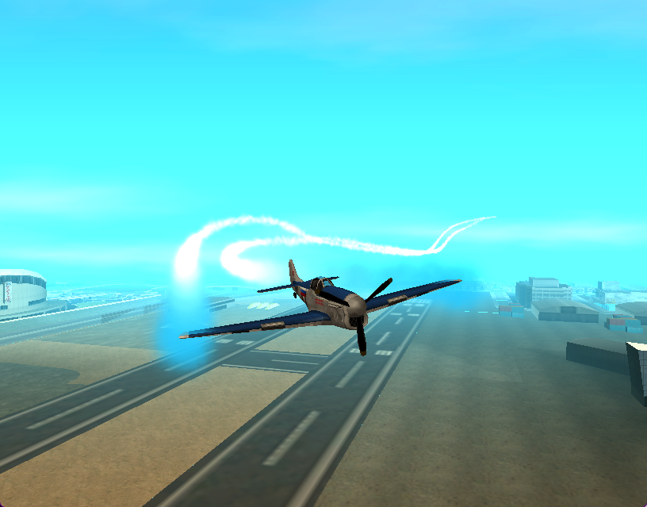

## Lua-скрипт TrailFX для Grand Theft Auto San Andreas Multiplayer
Добавляет дымы/инверсионный след любым самолётам.

## Зависимости

    1. [Moonloader](https://www.blast.hk/moonloader/download.php)
    2. [Sampfuncs](https://www.blast.hk/threads/17/)

## Установка.
1. Скопировать [скрипт](moonloader/TrailFX.lua) в `папку с игрой/moonloader/TrailFX.lua`.
2. Добавить содержимое [файла](models/effects.fxp) в `папку с игрой/models/effects.fxp`, в конец файла (подробнее в [инструкции к effects.fxp](models/README_RUS.md))