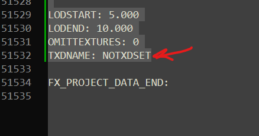

## Файл effects.fxp
В нём хранится информация об эффектах, используемых в игре. Так как скрипт не работает с памятью напрямую, для работы ему необходимо, чтобы в файле `effects.fxp` были добавлены используемые скриптом эффекты, а именно:
- trail_red_long
- trail_green_long
- trail_blue_long
- trail_sky_long
- trail_black_long
- trail_purp_long
- trail_red_short
- trail_green_short
- trail_blue_short
- trail_sky_short
- trail_black_short
- trail_purp_short

## Установка
Для добавления указанных выше эффектов, скопируйте содержимое файла [effects.fxp](./effects.fxp) и добавьте его в самый конец документа, перед строкой `FX_PROJECT_DATA_END:`, как показано на рисунке ниже:



## Редактирование эффектов
Сам файл представляет собой последовательное описание свойств эффекта, состоящего из партиклов (частиц) и включает в себя следующие блокои:

    - FX_SYSTEM_DATA
    заголовок каждого отдельно взятого эффекта

    - Блок с общей информацией: `FILENAME` - `NUM_PRIMS`

    - FX_PRIM_BASE_DATA 
    Базовые данные графического примитива эффектов

    - FX_INFO_EMRATE_DATA 
    Скорость эмиссии/частота создания частиц

    - FX_INFO_EMSPEED_DATA 
    Начальная скорость частиц при рождении

    - FX_INFO_EMANGLE_DATA
    Угол разлёта/разброса частиц

    - FX_INFO_EMLIFE_DATA 
    Время жизни частиц

    - FX_INFO_EMROTATION_DATA 
    Начальный угол вращения частиц

    - FX_INFO_ROTSPEED_DATA 
    Скорость вращения частиц

    - FX_INFO_FRICTION_DATA 
    Трение/сопротивление среды

    - FX_INFO_FORCE_DATA
    Внешние силы: гравитация, ветер

    - FX_INFO_SIZE_DATA
    Размер частиц

    - LOD (Уровень детализации):

        - LODSTART 
        Расстояние начала прорисовки

        - LODEND 
        Расстояние окончания прорисовки

    - FX_PRIM_EMITTER_DATA 
    Данные эмиттера (источника) графического примитива

### Изменение цвета
Для изменения цвета эффекта найдите блок с соответствующим эффектом, в нём блок `FX_INFO_COLOURBRIGHT_DATA`, далее блоки:

```c
RED->FX_KEYFLOAT_DATA->VAL // (2 значения)
GREEN->FX_KEYFLOAT_DATA->VAL // (2 значения)
BLUE->FX_KEYFLOAT_DATA->VAL // (2 значения)
ALPHA->FX_KEYFLOAT_DATA->VAL // (2 значения)
```

> [!TIP]
> #### Почему значений 2:
>
> В файле расписаны значения для разных этапов жизни частицы: от момента рождения в TIME: 0.000 до смерти в момент TIME: 1.000

Цвета могут быть дробным числом от 0.000 до 255.000, где 255 - максимальная яркость [RGBA](https://www.w3schools.com/Css/css_colors_rgb.asp) составляющей цвета

### Пример:
```bash
FX_INFO_COLOURBRIGHT_DATA:
TIMEMODEPRT: 1
RED:
FX_INTERP_DATA:
LOOPED: 0
NUM_KEYS: 2
FX_KEYFLOAT_DATA:
TIME: 0.000
VAL: 255.000 # Количество красного в начальный момент времени
FX_KEYFLOAT_DATA:
TIME: 0.150 
VAL: 255.000 # Количество красного в момент времени 0.150
GREEN:
FX_INTERP_DATA:
LOOPED: 0
NUM_KEYS: 2
FX_KEYFLOAT_DATA:
TIME: 0.000
VAL: 0.000 # Количество зелёного в начальный момент времени
FX_KEYFLOAT_DATA:
TIME: 0.150
VAL: 0.000 # Количество зелёного в момент времени 0.150
BLUE:
FX_INTERP_DATA:
LOOPED: 0
NUM_KEYS: 2
FX_KEYFLOAT_DATA:
TIME: 0.000
VAL: 0.000 # Количество синего в начальный момент времени
FX_KEYFLOAT_DATA:
TIME: 0.150
VAL: 0.000 # Количество синего в момент времени 0.150
ALPHA:
FX_INTERP_DATA:
LOOPED: 0
NUM_KEYS: 2
FX_KEYFLOAT_DATA:
TIME: 0.000
VAL: 255.000 # Прозрачность в начальный момент времени
FX_KEYFLOAT_DATA:
TIME: 0.150
VAL: 50.000 # Прозрачность в момент времени 0.150
BIAS:
FX_INTERP_DATA:
LOOPED: 0
NUM_KEYS: 2
FX_KEYFLOAT_DATA:
TIME: 0.000
VAL: 0.000  # Отслонение цветов частиц в начальный момент времени
FX_KEYFLOAT_DATA:
TIME: 0.150
VAL: 0.100 # Отклонение цветов частиц в момент времени 0.150 (значение из 
           # цвета +- 0.100)
```

### Пропадание эффекта, производительность
У игры есть общие ограничения на количество одновременно существующих частиц. При превышении данного ограничения, новые частицы не будут создаваться и отрисовываться пока старые не пропадут. Если часто возникают ситуации, когда дым перестаёт отображаться, вам необходимо снизить количество частиц в `FX_INFO_EMRATE_DATA`, либо снизить время жизни частиц в `FX_INFO_EMLIFE_DATA`.

### Важные значения в `FX_INFO_EMRATEDATA`
```bash
FX_INFO_EMRATE_DATA:
RATE:
FX_INTERP_DATA:
LOOPED: 0
NUM_KEYS: 2
FX_KEYFLOAT_DATA:
TIME: 0.000
# Количество создаваемых частиц в единицу времени. Чем выше значение - тем
# более насыщеным будет дым, но тем меньше можно установить время жизни
VAL: 50.000 # <---
FX_KEYFLOAT_DATA:
TIME: 0.100
VAL: 0.000
```

### Важные значения в `FX_INFO_EMLIFE_DATA`
```bash
FX_INFO_EMLIFE_DATA:
LIFE:
FX_INTERP_DATA:
LOOPED: 0
NUM_KEYS: 1
FX_KEYFLOAT_DATA:
TIME: 0.000
# Время жизни частиц. Чем выше значение тем более разряженным нужно
# создавать дым (в FX_INFO_EMRATEDATA)
VAL: 15.000 # <---
BIAS:
FX_INTERP_DATA:
LOOPED: 0
NUM_KEYS: 1
FX_KEYFLOAT_DATA:
TIME: 0.000
VAL: 0.000
```